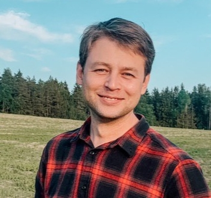

# Anton Shliaha

# My Contacts
* GSM: +375 29 624-41-33
* E-mail: anton@rza.by
* Telegram: [Anton_fartovii](http://t.me/Anton_fartovii)
* GitHub: [AntonFartovii](https://github.com/AntonFartovii)
* Discord: AntonFartovii#4574

# About me
Hello! I am JS developer. I am confident, I am ambitious, I am creative, I like the new phase of my developer career!

# Skills 
* HTML 5.0, CSS3
* JS, ES6, TS, NodeJS, Nest
* PHP
* VCS Git, Docker
* IDE: WebStorm, PhpStorm, VSCode, Figma

*	Finding solutions with limited budgets
*	Teamwork
*	Open-minded

# Code examples
```
function max(array) {
    const l = array.length;
    if (l == 0) return -Infinity;
  
    const num = array[0];
    if (l == 1) return num;
    
    else if (l > 2)   {
      const newArr = array[0] >= array[l-1] ? array.slice(0,-1) : array.slice(1,0)
      max(newArr)
      }
    return num
}
```

# Experience

2008 – 2022
 
Energy business CEO:

•	Head of service department partner organization Schneider Electric in Belarus, 5+ years

•	Head of sales and engineering department partner organization Schneider Electric in Belarus, 5+ years

2007 - 2008

Assembler developer 1 year at Integral GmbH

# Education
RS School

Now, I have been learning courses JS Stage Frontend, React and NodeJS

2002 – 2007

* Belarusian university of informatics and radio electronics 
    + Faculty of radio technical and electronic 

# My Projects

http://rza.by

# Languages
* English Pre-Intermediate A2
* French Pre-Intermediate A2
* Russian 
* Polish
