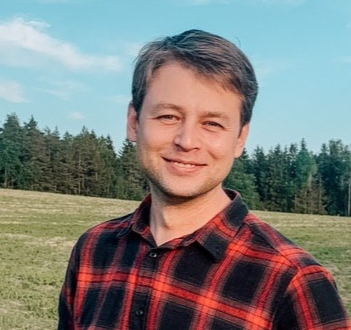

# Anton Shliaha

# My Contacts
* GSM: +375 29 624-41-33
* E-mail: anton@rza.by
* Telegram: [Anton_fartovii](http://t.me/Anton_fartovii)
* GitHub: [AntonFartovii](https://github.com/AntonFartovii)
* Discord: AntonFartovii#4574

# About me
My target is to become a JS Front-end developer. 
For a long time it was a hobby for me, but i very like to find solutions for logical tasks. 

# Skills 
* HTML (basic)
* CSS (basic)
* JS (basic)
* PHP (basic)
* Version control Git
* IDE: WebStorm, PhpStorm

# Code examples
```
function max(array) {
    const l = array.length;
    if (l == 0) return -Infinity;
  
    const num = array[0];
    if (l == 1) return num;
    
    else if (l > 2)   {
      const newArr = array[0] >= array[l-1] ? array.slice(0,-1) : array.slice(1,0)
      max(newArr)
      }
    return num
}
```

# Experience
Energy business CEO (sales, engineering, 10+ year)

# Education
* Belarusian university of informatics and radioelectronics 
    + Faculty of radio technical and electronic 

# Languages
* English Pre-Intermediate A2
* French Pre-Intermediate A2
* Russian 